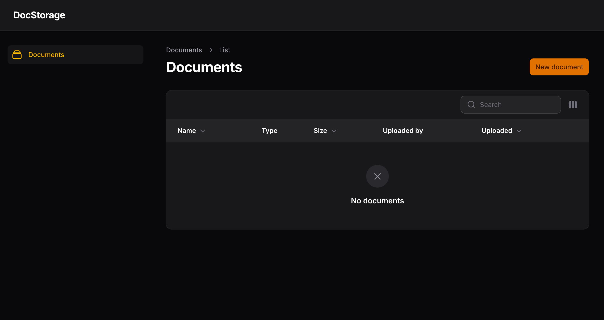

### Setup

```bash
cp docker/.env.dist docker/.env
cp .env.example .env

cd docker
docker-compose up -d

docker exec doc_storage_php bash -c "composer install"
docker exec doc_storage_php bash -c "php artisan migrate"
```

### Usage
Documents list (Use "New document" button for upload documents):

http://localhost:8085/doc/documents


